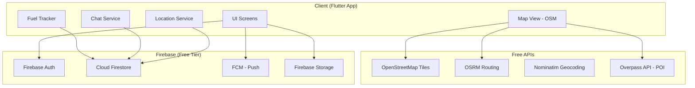

# 🚗 Travel Buddy App — Complete Plan

## App Overview
A **team-based travel companion app** where users form travel groups, share real-time locations on a map, track fuel/costs, communicate via chat/calls, and share travel experiences.

---

## Core Features

### Phase 1 — MVP (Launch)
| Feature | Description |
|---|---|
| **Team System** | Create/join teams via invite code or QR |
| **Live Map** | See all team members on a map in real-time |
| **Location Sharing** | Real-time GPS broadcasting to team |
| **Speed Tracker** | Show each member's current speed |
| **Team Chat** | Text messaging within teams |
| **Fuel Tracker** | Log fuel fills, calculate mileage/cost |
| **Trip Logger** | Start/stop trips, track distance + duration |

### Phase 2 — Growth
| Feature | Description |
|---|---|
| **Voice Calls** | Team voice calls (walkie-talkie style) |
| **Nearby POI** | Show fuel pumps, hotels, restaurants on map |
| **Travel Blog** | Upload photos, viewpoints, route maps |
| **Cost Splitter** | Split fuel/hotel costs among team members |
| **Offline Maps** | Download map regions for no-signal areas |

### Phase 3 — Community
| Feature | Description |
|---|---|
| **Public Routes** | Share travel routes with the community |
| **Hotel/Viewpoint Reviews** | User-generated reviews with photos |
| **Road Conditions** | Report potholes, closures, police checks |
| **Leaderboard** | Best mileage, most trips, top reviewers |

---

## Tech Stack (Low/No Cost)

### App Framework
| Component | Choice | Cost |
|---|---|---|
| **Framework** | Flutter (cross-platform: Android + iOS) | **Free** |
| **Language** | Dart | **Free** |

### Backend & Database
| Component | Choice | Cost | Free Tier |
|---|---|---|---|
| **Auth** | Firebase Auth (Google Sign-In) | **Free** | 10K users/month |
| **Database** | Cloud Firestore | **Free** | 50K reads, 20K writes/day |
| **Real-time Location** | Firestore real-time listeners | **Free** | Included in above |
| **File Storage** | Firebase Storage | **Free** | 5GB storage, 1GB/day download |
| **Push Notifications** | Firebase Cloud Messaging (FCM) | **Free** | Unlimited |
| **Hosting** | Firebase Hosting (web version) | **Free** | 10GB/month |

### Maps & Location
| Component | Choice | Cost |
|---|---|---|
| **Map SDK** | OpenStreetMap + `flutter_map` | **Free** (no API key needed) |
| **Map Tiles** | OpenStreetMap tiles | **Free** |
| **Geocoding** | Nominatim (OSM) | **Free** |
| **POI Data** | Overpass API (OSM) — fuel pumps, hotels, etc. | **Free** |
| **Routing/Directions** | OSRM (Open Source Routing) | **Free** |
| **GPS** | Device GPS via `geolocator` package | **Free** |

> [!TIP]
> **Why NOT Google Maps?** Google Maps charges after 28K map loads/month ($7/1000 loads). OpenStreetMap is **completely free** with no limits. When you grow big, you can switch to Google Maps or Mapbox later.

### Communication
| Component | Choice | Cost |
|---|---|---|
| **Text Chat** | Firestore real-time collections | **Free** |
| **Voice Calls (Phase 2)** | WebRTC via `flutter_webrtc` | **Free** (peer-to-peer) |
| **Push Notifications** | FCM | **Free** |

### CI/CD & Distribution
| Component | Choice | Cost |
|---|---|---|
| **CI/CD** | GitHub Actions | **Free** (2000 min/month) |
| **Android Distribution** | Google Play Store | **₹2,100 one-time** |
| **iOS Distribution** | Apple App Store | **₹8,000/year** (skip initially) |

---

## Architecture



---

## Firestore Database Structure

```
users/{userId}
  ├── email, name, photoUrl
  ├── vehicleType, vehicleName
  └── createdAt

teams/{teamId}
  ├── name, inviteCode, createdBy
  ├── members: [userId1, userId2, ...]
  └── createdAt

teams/{teamId}/locations/{userId}
  ├── lat, lng, speed, heading
  ├── altitude, accuracy
  └── updatedAt  (real-time, updates every 5 sec)

teams/{teamId}/messages/{messageId}
  ├── senderId, senderName
  ├── text, imageUrl
  └── timestamp

teams/{teamId}/trips/{tripId}
  ├── userId, startTime, endTime
  ├── distance, avgSpeed, maxSpeed
  ├── route: [{lat, lng, time}, ...]
  └── fuelEntries: [{liters, cost, odometer}, ...]

travel_posts/{postId}
  ├── userId, teamId
  ├── title, description
  ├── photos: [url1, url2, ...]
  ├── viewpoints: [{lat, lng, name, rating}, ...]
  ├── route: [{lat, lng}, ...]
  ├── totalCost, hotels, tips
  └── likes, createdAt
```

---

## Key Screens

| Screen | What it shows |
|---|---|
| **Home/Dashboard** | Active trip stats, team status, quick actions |
| **Live Map** | All team members with speed badges, POI markers |
| **Team Management** | Create/join teams, invite members, QR code |
| **Trip Tracker** | Start/stop trip, live speed/distance/time |
| **Fuel Log** | Add fuel entries, mileage chart, cost summary |
| **Team Chat** | Real-time messaging with photos |
| **Travel Feed** | Community travel posts with photos/routes |
| **Profile** | Vehicle details, trip history, stats |

---

## Cost Estimation

### Launch (₹0 - ₹2,100)

| Item | Cost |
|---|---|
| Flutter + Dart | ₹0 |
| Firebase (free tier) | ₹0 |
| OpenStreetMap | ₹0 |
| GitHub + Actions | ₹0 |
| Google Play Store | ₹2,100 (one-time) |
| **Total** | **₹2,100** |

### Monthly Running Cost (up to ~500 users)

| Item | Cost |
|---|---|
| Firebase free tier (50K reads/day) | ₹0 |
| OpenStreetMap tiles | ₹0 |
| OSRM routing | ₹0 |
| **Total/month** | **₹0** |

### When to Scale (1000+ active users)

| Upgrade | When | Cost |
|---|---|---|
| Firebase Blaze plan | >50K reads/day | ~₹500-2000/month |
| Own tile server | Very heavy map use | ₹800/month (VPS) |
| Mapbox or Google Maps | Premium features needed | Pay-per-use |

---

## Free Tier Limits (How far ₹0 goes)

| Service | Free Limit | Enough for |
|---|---|---|
| Firestore reads | 50,000/day | ~200-300 active users |
| Firestore writes | 20,000/day | ~200-300 active users |
| Firebase Storage | 5 GB | ~5,000 photos |
| Firebase Auth | Unlimited | Unlimited users |
| FCM Push | Unlimited | Unlimited notifications |
| OSM Map tiles | Unlimited | Unlimited map views |
| GitHub Actions | 2,000 min/month | ~60 builds/month |

---

## Dependencies (Flutter Packages)

```yaml
dependencies:
  flutter_map: any           # OpenStreetMap map widget
  latlong2: any              # Lat/lng calculations
  geolocator: any            # GPS location
  firebase_core: any
  firebase_auth: any
  cloud_firestore: any
  firebase_storage: any
  firebase_messaging: any    # Push notifications
  google_sign_in: any
  image_picker: any          # Photo upload
  cached_network_image: any  # Image caching
  fl_chart: any              # Fuel/speed charts
  qr_flutter: any            # QR code for team invite
  qr_code_scanner: any       # Scan QR to join team
  share_plus: any            # Share invite links
  intl: any                  # Date/number formatting
  uuid: any                  # Unique IDs
  shared_preferences: any    # Local storage
```

---

## Implementation Order

### Sprint 1 (Week 1-2): Foundation
- [ ] Create Flutter project
- [ ] Firebase setup (Auth, Firestore, Storage)
- [ ] Google Sign-In
- [ ] User profile screen
- [ ] Basic app navigation

### Sprint 2 (Week 3-4): Teams
- [ ] Create team (name + auto-generated invite code)
- [ ] Join team (enter code or scan QR)
- [ ] Team list & member management
- [ ] Leave/delete team

### Sprint 3 (Week 5-6): Live Map
- [ ] OpenStreetMap integration (`flutter_map`)
- [ ] GPS location tracking (background service)
- [ ] Broadcast location to Firestore (every 5 sec while active)
- [ ] Show team members on map with speed badges
- [ ] Center/follow mode

### Sprint 4 (Week 7-8): Trip & Fuel
- [ ] Start/stop trip tracking
- [ ] Distance, speed, duration calculation
- [ ] Fuel entry logging (liters, cost, odometer)
- [ ] Mileage calculation (km/l)
- [ ] Trip history with stats

### Sprint 5 (Week 9-10): Chat & POI
- [ ] Team chat (Firestore real-time)
- [ ] Photo sharing in chat
- [ ] Show fuel pumps on map (Overpass API)
- [ ] Show hotels/restaurants on map
- [ ] Tap POI for details + navigation

### Sprint 6 (Week 11-12): Travel Feed & Polish
- [ ] Travel post creation (photos, route, tips)
- [ ] Travel feed (community posts)
- [ ] Push notifications for team events
- [ ] App polish, animations, performance
- [ ] Play Store submission

---

## Revenue Model (Future)

| Method | When |
|---|---|
| **Ads** (Google AdMob) | After 1000+ users |
| **Premium Plan** (₹99/month) | Remove ads, offline maps, unlimited teams |
| **Sponsored POI** | Hotels/fuel stations pay for visibility |
| **Affiliate Links** | Hotel booking links (MakeMyTrip, Booking.com) |

---

## Risk Mitigation

> [!WARNING]
> **Battery Drain**: GPS every 5 sec kills battery. Solution: reduce to 15 sec when speed < 5 km/h, use significant location changes when stationary.

> [!WARNING]
> **Firestore Costs**: Real-time location = lots of writes. Solution: batch location updates, use `merge: true`, throttle to 1 write/5 sec per user.

> [!IMPORTANT]
> **Privacy**: Always show clear "location sharing active" indicator. Let users pause sharing anytime. Never share location outside the team.

---

## Summary

| Aspect | Decision |
|---|---|
| **Platform** | Flutter (Android first, iOS later) |
| **Maps** | OpenStreetMap (free forever) |
| **Backend** | Firebase (free up to 500 users) |
| **Chat** | Firestore real-time |
| **Calls** | WebRTC (Phase 2) |
| **Launch Cost** | ₹2,100 (Play Store fee only) |
| **Monthly Cost** | ₹0 until 500+ users |
| **Timeline** | 12 weeks to MVP |
