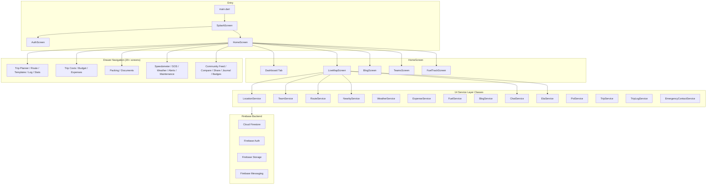
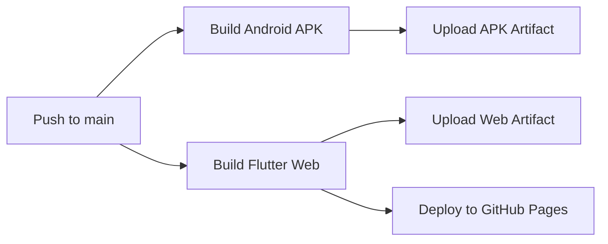

# TravelBuddy — Full Codebase Analysis & Graphify Setup

## Project Overview

**TravelBuddy** is a team-based travel companion app built with **Flutter 3.29** targeting **Android, iOS, and Web**. It uses **Firebase** as its backend (Auth, Firestore, Storage, Messaging) and features a dark-themed Material 3 UI with Google Fonts (Inter).

> [!TIP]
> The interactive knowledge graph is ready at [graph.html](file:///d:/TravelBuddy/graphify-out/graph.html) — open in a browser to explore the architecture visually.

---

## Architecture Summary

---

## Graph Statistics

| Metric | Value |
|--------|-------|
| **Total files** | 111 |
| **Total words** | ~52,299 |
| **Graph nodes** | 1,084 |
| **Graph edges** | 1,570 |
| **Communities** | 73 (64 significant) |
| **God node** | `pubspec.yaml` (26 edges) |

---

## Key Features (42 Screens)

| Category | Screens | Description |
|----------|---------|-------------|
| **Navigation** | Home, Live Map, Speedometer | Bottom nav with 5 tabs + drawer menu |
| **Auth** | Splash, Auth | Google Sign-In (popup for web, native for mobile) |
| **Teams** | Teams, Team Detail, Team Chat | Create/join teams via 6-char invite codes |
| **Trip Planning** | Trip Planner, Route Optimizer, Trip Templates, Trip Log, Trip Stats | Full trip lifecycle management |
| **Finance** | Expense, Group Expense, Budget Planner, Trip Cost, Expense Analytics, Currency Converter, Toll Calculator, Mileage Calculator | Comprehensive cost tracking with split expenses |
| **Fuel** | Fuel Track, Fuel Price | Odometer-based mileage tracking & price logging |
| **Content** | Blog, Community Feed, Trip Post, Trip Sharing, Travel Journal, Travel Badges | Social features with image upload |
| **Safety** | SOS, Emergency Info, Travel Alerts | Emergency contacts, travel advisories |
| **Utilities** | Weather, Smart Packing, Packing List, Document Wallet, Discover Places, Vehicle Maintenance, Checklist | Travel preparation tools |

---

## External APIs & Services

| Service | Purpose | Auth |
|---------|---------|------|
| **Firebase** (Auth, Firestore, Storage) | Backend for all data | API keys in `firebase_options.dart` |
| **Google Maps** (JS + Flutter) | Map rendering in LiveMapScreen | API key in `web/index.html` |
| **OSRM** | Route directions & distances | Free, no key |
| **Open-Meteo** | Weather data & forecasts | Free, no key |
| **Overpass API** (OSM) | Nearby POI search | Free, no key |
| **Geoapify** | Enriched nearby places data | API key hardcoded |

---

## God Nodes (Most Connected)

1. **`pubspec.yaml`** — 26 edges — central dependency hub connecting every package
2. **`project_info`** — 4 edges — Google Services configuration
3. **`_SosScreenState`** — 4 edges — SOS emergency screen
4. **`_SpeedScreenState`** — 4 edges — Speedometer screen
5. **`_SplashScreenState`** — 4 edges — Splash animation screen

---

## Surprising Connections

- **CI/CD ↔ Dependencies**: `build.yml` jobs are conceptually linked to `pubspec.yaml` — changes to dependencies directly affect both Android APK and Web builds
- **CI/CD ↔ Web**: The "Build Flutter Web" job links to `web/index.html` — web-specific assets are part of the CI pipeline
- **iOS Launch ↔ README**: The launch screen assets readme references the main project README
- **README ↔ pubspec**: The project description and pubspec share the TravelBuddy concept

---

## Suggested Questions for Graph Exploration

1. **Why does `latLng` bridge Nearby Places Service ↔ Live Map?**
   _High betweenness centrality — this node is the geographic coordinate bridge between location discovery and map rendering._

2. **Why does `WeatherData` connect Document Wallet ↔ Screen Imports Hub?**
   _The weather service data model crosses multiple community boundaries._

3. **Should Live Map & Navigation (67 nodes) be split into smaller modules?**
   _Cohesion score 0.03 — this is the largest and most weakly-interconnected community._

4. **Should Screen Imports Hub (56 nodes) be split?**
   _The HomeScreen imports 25+ screens — a routing/navigation refactor could help._

---

## CI/CD Pipeline

- **Flutter 3.29.0 stable**, Java 17 (Temurin)
- Android: `flutter build apk --release --split-per-abi`
- Web: `flutter build web --release --base-href "/TravelBuddy/"`
- Auto-deploys to GitHub Pages on `main` push

---

## Graphify Outputs

| File | Description |
|------|-------------|
| [graph.html](file:///d:/TravelBuddy/graphify-out/graph.html) | Interactive knowledge graph — open in browser |
| [GRAPH_REPORT.md](file:///d:/TravelBuddy/graphify-out/GRAPH_REPORT.md) | Full audit report with communities & cohesion |
| [graph.json](file:///d:/TravelBuddy/graphify-out/graph.json) | Raw graph data for queries |

> [!NOTE]
> Use `/graphify query "your question"` to explore the graph. Example:
> - `graphify query "How does location sharing work between team members?"`
> - `graphify query "What services does the LiveMapScreen depend on?"`
> - `graphify path "LocationService" "TeamService"`

---

## Observations & Recommendations

> [!WARNING]
> **Hardcoded API keys detected** in:
> - [firebase_options.dart](file:///d:/TravelBuddy/lib/firebase_options.dart) — Firebase API keys (acceptable for Firebase, but still notable)
> - [nearby_service.dart](file:///d:/TravelBuddy/lib/services/nearby_service.dart#L11) — Geoapify API key hardcoded on line 11
> - [web/index.html](file:///d:/TravelBuddy/web/index.html) — Google Maps JS API key

> [!IMPORTANT]
> **Architecture observations:**
> - **No state management** — the app uses `StatefulWidget` everywhere with no Provider/Riverpod/BLoC
> - **No models directory** — data models are inline or defined in service files (e.g., `WeatherData`, `NearbyPlace`)
> - **All services use static methods** — no dependency injection, making testing harder
> - **`home_screen.dart` is 1,169 lines** — the largest screen, handling dashboard, drawer, and 5 sub-widgets
> - **`live_map_screen.dart` is 1,676 lines** — extremely large, handling map, routes, nearby places, team tracking, chat
> - **No error boundaries** — most errors are silently caught with `debugPrint`
> - **747 isolated nodes** in the graph — many internal symbols have no cross-file connections
