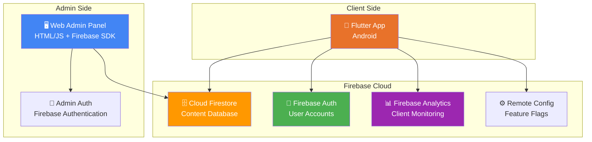
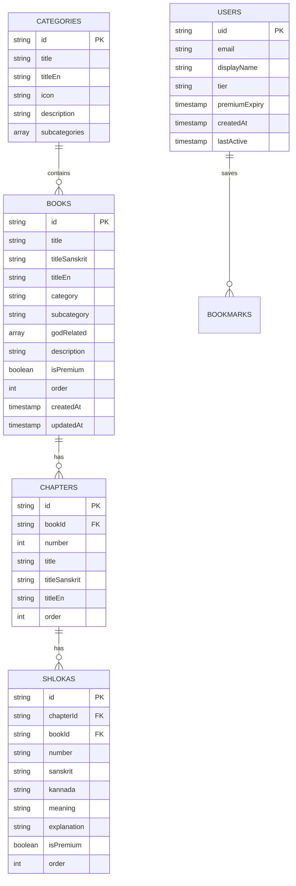
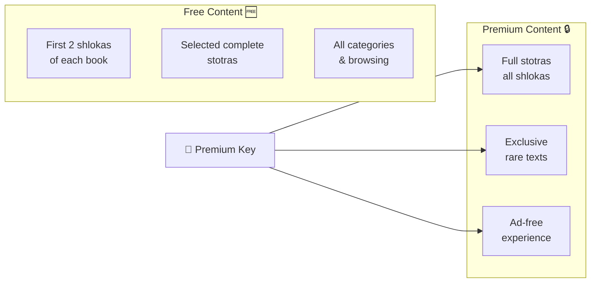

# Firebase Backend + Admin Panel for Bharatiyam Gratha Sudha

Build a full Firebase-powered backend with a web admin panel to manage content, premium subscriptions, and client analytics — all without rebuilding the APK.

## System Architecture



---

## Phased Approach

We'll implement this in **4 phases**, each delivering a working feature:

| Phase | What | Priority |
|-------|------|----------|
| **Phase 1** | Firebase setup + Firestore content DB | 🔴 Now |
| **Phase 2** | Web admin panel to add/edit content | 🔴 Now |
| **Phase 3** | Premium/free tier + lock/unlock system | 🟡 Next |
| **Phase 4** | User auth + client monitoring | 🟡 Next |

---

## Phase 1: Firebase Setup + Firestore Database

### Firestore Schema



### Files to Create/Modify

#### [NEW] `admin/index.html` — Admin panel entry point
#### [NEW] `admin/css/admin.css` — Admin panel styles
#### [NEW] `admin/js/firebase-config.js` — Firebase configuration
#### [NEW] `admin/js/admin.js` — Admin panel logic
#### [NEW] `admin/js/content-editor.js` — Content editing logic

#### [NEW] `firebase/firestore.rules` — Security rules
```
rules_version = '2';
service cloud.firestore {
  match /databases/{database}/documents {
    // Anyone can read non-premium content
    match /categories/{doc} { allow read: if true; }
    match /books/{doc} { allow read: if true; }
    match /chapters/{doc} { allow read: if true; }
    match /shlokas/{doc} {
      allow read: if !resource.data.isPremium || isAuthenticated();
    }
    
    // Only admins can write
    match /{document=**} {
      allow write: if isAdmin();
    }
    
    function isAuthenticated() {
      return request.auth != null;
    }
    function isAdmin() {
      return request.auth != null 
        && request.auth.token.admin == true;
    }
  }
}
```

#### [NEW] `firebase/firebase.json` — Firebase project config
#### [NEW] `firebase/firestore.indexes.json` — Firestore indexes

---

### Flutter App Changes (Phase 1)

#### [MODIFY] [pubspec.yaml](file:///d:/bharatheeyam%20books/pubspec.yaml)
Add Firebase dependencies:
```yaml
dependencies:
  firebase_core: ^3.8.1
  cloud_firestore: ^5.6.0
  firebase_auth: ^5.4.1
  firebase_analytics: ^11.4.1
  firebase_remote_config: ^5.3.1
```

#### [NEW] `lib/services/firebase_service.dart`
Singleton service for Firebase initialization and Firestore operations:
- `init()` — initialize Firebase
- `fetchCategories()` → from Firestore
- `fetchBooks(category, subcategory)` → from Firestore
- `fetchChapters(bookId)` → from Firestore  
- `fetchShlokas(chapterId)` → from Firestore
- `searchContent(query)` → full-text search
- Local caching with `shared_preferences` for offline support

#### [MODIFY] [content_data.dart](file:///d:/bharatheeyam%20books/lib/data/content_data.dart)
- Keep as **bundled fallback** content for first launch / offline
- Add `uploadToFirestore()` method to seed Firestore with existing data

#### [MODIFY] [shloka.dart](file:///d:/bharatheeyam%20books/lib/models/shloka.dart)
- Add `isPremium` field to `Book` and `Shloka`
- Add `order` field for custom sorting
- Add `fromFirestore()` factory constructors
- Add `toFirestore()` methods

#### [NEW] `android/app/google-services.json`
Firebase configuration file (generated from Firebase Console)

#### [MODIFY] [build.gradle (app)](file:///d:/bharatheeyam%20books/android/app/build.gradle)
Add Google Services plugin:
```gradle
plugins {
    id "com.google.gms.google-services"
}
```

#### [MODIFY] [build.gradle (root)](file:///d:/bharatheeyam%20books/android/build.gradle)
Add classpath for Google Services

#### [MODIFY] [settings.gradle](file:///d:/bharatheeyam%20books/android/settings.gradle)
Add Google Services plugin version

---

## Phase 2: Web Admin Panel

A beautiful, responsive web interface for managing all content.

### Admin Panel Features

```
┌─────────────────────────────────────────────────┐
│  🛕 Bharatiyam Admin Panel                      │
├─────────┬───────────────────────────────────────┤
│         │                                       │
│ 📊 Dashboard                                    │
│         │  Total Books: 8                       │
│ 📚 Books│  Total Shlokas: 45                    │
│         │  Active Users: --                     │
│ ➕ Add  │  Premium Users: --                    │
│   New   │                                       │
│         ├───────────────────────────────────────┤
│ 👥 Users│  Recent Books                         │
│         │  ┌─────────────────────────────────┐  │
│ 📈 Stats│  │ 🕉️ Shiva Panchakshari │ Edit ✏️│  │
│         │  │ 🕉️ Lingashtakam       │ Edit ✏️│  │
│ ⚙️ Config│ │ 🕉️ Bilvashtakam       │ Edit ✏️│  │
│         │  └─────────────────────────────────┘  │
└─────────┴───────────────────────────────────────┘
```

### Key Admin Features

| Feature | Description |
|---------|-------------|
| **📚 Browse Books** | List all books with filters (category, god, premium status) |
| **➕ Add Book** | Form with: title (Kannada/Sanskrit/English), category, subcategory, premium toggle |
| **📝 Edit Book** | Modify any book's metadata |
| **➕ Add Chapter** | Add chapters to a book |
| **➕ Add Shloka** | Rich form for sanskrit, kannada transliteration, meaning, explanation |
| **🔒 Premium Toggle** | Mark any book/shloka as premium with one click |
| **📋 Bulk Import** | Paste multiple shlokas at once (CSV or structured text) |
| **👀 Preview** | Live preview of how content looks in the app |
| **🔄 Seed Data** | One-click upload of existing bundled content to Firestore |

### Admin Panel Tech Stack
- **Pure HTML/CSS/JS** — no framework needed, simple to host
- **Firebase JS SDK** — direct Firestore access
- **Firebase Hosting** — free, deployed at `https://bharatiyam-admin.web.app`
- **Admin Auth** — email/password login, protected by Firebase Auth custom claims

---

## Phase 3: Premium/Free Tier System (Future)

### Content Locking Model



### Implementation
- `isPremium` flag on `Book` and `Shloka` documents
- Free users see a lock icon and "Upgrade to Premium" prompt
- Premium unlocked via Firebase Auth custom claims
- Admin panel has toggle to mark content as free/premium
- Firebase Remote Config for dynamic feature flags

---

## Phase 4: User Auth + Client Monitoring (Future)

### Firebase Analytics Events
| Event | When |
|-------|------|
| `app_open` | App launched |
| `book_viewed` | User opens a book |
| `shloka_read` | User reads a shloka |
| `bookmark_added` | User saves a shloka |
| `search_performed` | User searches |
| `premium_prompt_shown` | Lock screen shown |
| `premium_purchased` | User upgrades |

### User Authentication Flow
```
Guest Mode → Browse free content → Hit premium lock
    → Sign up (email/Google) → Purchase premium → Unlock all
```

---

## User Review Required

> [!IMPORTANT]
> **Firebase Project Setup Required**: Before I can write the code, you need to create a Firebase project:
> 1. Go to [Firebase Console](https://console.firebase.google.com/)
> 2. Create a new project named **"Bharatiyam Gratha Sudha"**
> 3. Enable **Firestore Database** (start in test mode)
> 4. Enable **Authentication** → Email/Password provider
> 5. Enable **Analytics**
> 6. Add an **Android app** with package name `com.bharatiyam.granthasudha`
> 7. Download `google-services.json` and place it at `d:\bharatheeyam books\android\app\google-services.json`
> 8. Add a **Web app** → copy the Firebase config (apiKey, projectId, etc.)
>
> Share the **web app Firebase config** with me and confirm `google-services.json` is placed, and I'll build everything.

> [!WARNING]
> **Firestore Security**: We'll start in test mode for development, but before going to production, the security rules must be locked down to prevent unauthorized writes.

## Open Questions

> [!IMPORTANT]
> **Admin access**: Who should have admin access to the content panel? Just you, or multiple people? This determines whether we use a simple password or role-based access.

> [!NOTE]
> **Hosting for admin panel**: The admin panel can be hosted free on Firebase Hosting (`bharatiyam-admin.web.app`). Should I set this up, or would you prefer to host it elsewhere?

---

## Verification Plan

### Phase 1 Verification
- Seed existing content to Firestore → verify all books/shlokas appear
- Open app → verify it loads content from Firestore
- Turn off internet → verify app works with cached/bundled content

### Phase 2 Verification
- Log into admin panel → add a new stotra
- Open app → verify new stotra appears without app update
- Edit a shloka in admin → verify change reflects in app

### Phase 3-4 Verification
- Mark a book as premium → verify lock appears for free users
- Create a premium account → verify content unlocks
- Check Firebase Analytics dashboard → verify events are tracked
