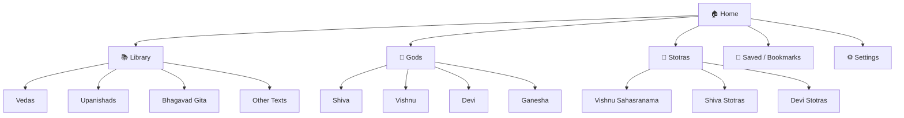

# Bharatiyam Gratha Sudha — ಭಾರತೀಯಂ ಗ್ರಂಥ ಸುಧಾ

A digital library app for Indian spiritual/religious texts with Sanskrit shlokas, Kannada transliteration, and Kannada explanations.

## Approach: Two-Phase Delivery

### Phase 1 — Web Prototype (Immediate)
Build a beautiful, fully functional **HTML/CSS/JS web app** in the workspace so you can immediately test all features in the browser — no Flutter SDK setup needed. This serves as:
- A live feature testbed
- A design reference for the Flutter app
- A standalone web version you can host

### Phase 2 — Flutter Android App (After approval)
Build the production **Flutter app** targeting Android + Web, with GitHub Actions CI/CD for building APKs.

> [!IMPORTANT]
> **Why this two-phase approach?** Setting up Flutter, Dart SDK, and Android SDK takes time and requires specific environment setup. By building the web prototype first, you can immediately see and test every feature, give feedback on design/UX, and provide the actual book texts — all before we invest in Flutter scaffolding.

---

## User Review Required

> [!IMPORTANT]
> **Content Needed**: You mentioned you'll provide the book texts. I need at least one sample text (a few shlokas with Sanskrit, Kannada, and meaning) to build the prototype with real content. For now, I'll use placeholder Sanskrit shlokas to demonstrate the layout.

> [!WARNING]
> **App Name Confirmation**: The app name "ಭಾರತೀಯಂ ಗ್ರಂಥ ಸುಧಾ" (Bharatiyam Gratha Sudha) — is this the final name? This will be used in the app title, splash screen, and Play Store listing.

## Open Questions

1. **Categories**: You mentioned "different subject related sections" and "god related sections". Can you list the specific categories? For example:
   - **Subject sections**: Vedas, Upanishads, Bhagavad Gita, Ramayana, Mahabharata, Puranas?
   - **God sections**: Shiva, Vishnu, Devi, Ganesha, Hanuman, Surya?
   - **Stotra section**: Vishnu Sahasranama, Lalita Sahasranama, Shiva Tandava Stotram?

2. **Offline support**: Should the app work fully offline (all texts bundled in the app) or download content from a server?

3. **Audio**: Do you want audio recitation of shlokas in future versions?

4. **Theme**: Do you prefer a traditional/spiritual aesthetic (saffron, gold, temple motifs) or a modern minimalist design?

---

## Architecture & Design

### Content Data Model

Each book is structured as:
```
Book
├── title (Sanskrit + Kannada)
├── category (subject / god / stotra)
├── chapters[]
│   ├── title
│   └── shlokas[]
│       ├── id (unique)
│       ├── number
│       ├── sanskrit_text (Devanagari)
│       ├── kannada_text (Kannada script)
│       ├── meaning_kannada (explanation)
│       └── metadata (chapter, verse number)
```

Content stored as **JSON files** — easy to edit, version control in GitHub, and load dynamically.

### App Sections



### Shloka Display Layout

Each shloka card will show three layers:

| Layer | Script | Purpose |
|-------|--------|---------|
| **1. Original** | Sanskrit (Devanagari) | `ॐ भूर्भुवः स्वः` — shown in a decorative Sanskrit font |
| **2. Kannada** | Kannada script | `ಓಂ ಭೂರ್ಭುವಃ ಸ್ವಃ` — transliteration in Kannada |
| **3. Meaning** | Kannada | Detailed meaning and explanation in Kannada |

Each card has a **bookmark/save button** (heart icon) that persists to local storage.

### UI Theme — Spiritual Premium

- **Color palette**: Deep saffron (#FF6F00), temple gold (#FFD700), sacred maroon (#800020), warm cream (#FFF8E7)
- **Dark mode**: Deep indigo (#1A1A2E) with gold accents
- **Fonts**: Noto Sans Devanagari (Sanskrit), Noto Sans Kannada (Kannada), Inter (UI)
- **Decorative elements**: Subtle mandala patterns, lotus borders, Om watermarks
- **Animations**: Smooth page transitions, card reveal animations, gentle glow effects on sacred text

---

## Phase 1: Web Prototype — Proposed Changes

### File Structure
```
d:\bharatheeyam books\
├── web/
│   ├── index.html          ← Main app shell
│   ├── css/
│   │   └── styles.css      ← Complete design system
│   ├── js/
│   │   ├── app.js          ← Main app logic & routing
│   │   ├── data.js         ← Book/shloka content (JSON)
│   │   └── storage.js      ← Bookmark persistence (localStorage)
│   └── assets/
│       └── images/         ← Generated decorative images
├── data/
│   └── books/              ← JSON content files (shared with Flutter later)
│       ├── bhagavad_gita.json
│       └── ...
```

### [NEW] [index.html](file:///d:/bharatheeyam%20books/web/index.html)
- Single-page app shell with navigation
- Responsive layout (mobile-first, works on desktop too)
- Google Fonts loading (Noto Sans Devanagari, Noto Sans Kannada)
- SEO meta tags

### [NEW] [styles.css](file:///d:/bharatheeyam%20books/web/css/styles.css)
- Complete design system with CSS custom properties
- Spiritual premium theme (saffron, gold, dark mode)
- Shloka card styling with Sanskrit/Kannada typography
- Mandala decorative patterns via CSS
- Smooth transitions and micro-animations
- Responsive breakpoints

### [NEW] [app.js](file:///d:/bharatheeyam%20books/web/js/app.js)
- Client-side routing (hash-based)
- Section rendering (Library, Gods, Stotras, Saved)
- Shloka card rendering with 3-layer layout
- Search functionality
- Theme toggling (light/dark)

### [NEW] [data.js](file:///d:/bharatheeyam%20books/web/js/data.js)
- Sample content: Bhagavad Gita Chapter 1 (first few shlokas)
- Sample Stotras: Gayatri Mantra, Vishnu Sahasranama opening
- Structured as JS objects matching the data model above

### [NEW] [storage.js](file:///d:/bharatheeyam%20books/web/js/storage.js)
- LocalStorage-based bookmark system
- Save/unsave shlokas by ID
- Retrieve all bookmarked shlokas
- Export bookmarks as JSON

---

## Phase 2: Flutter App (After Phase 1 approval)

### Technology Choices

| Choice | Decision | Rationale |
|--------|----------|-----------|
| **Framework** | Flutter | Single codebase for Android + Web; excellent Indic script rendering |
| **Language** | Dart | Required by Flutter |
| **State Management** | Provider | Simple, sufficient for this app's complexity |
| **Local Storage** | Hive | Fast, lightweight NoSQL — perfect for bookmarks |
| **Content Storage** | JSON assets | Easy to update, version-controllable |
| **Fonts** | Noto Sans Devanagari + Noto Sans Kannada | Best open-source Indic fonts |
| **CI/CD** | GitHub Actions | Auto-build APK on push |

### Flutter Project Structure
```
d:\bharatheeyam books\bharatiyam_app\
├── lib/
│   ├── main.dart
│   ├── models/
│   │   ├── book.dart
│   │   ├── shloka.dart
│   │   └── category.dart
│   ├── screens/
│   │   ├── home_screen.dart
│   │   ├── library_screen.dart
│   │   ├── god_section_screen.dart
│   │   ├── stotra_screen.dart
│   │   ├── reader_screen.dart
│   │   ├── saved_screen.dart
│   │   └── settings_screen.dart
│   ├── widgets/
│   │   ├── shloka_card.dart
│   │   ├── book_tile.dart
│   │   ├── category_grid.dart
│   │   └── nav_bar.dart
│   ├── providers/
│   │   ├── book_provider.dart
│   │   └── bookmark_provider.dart
│   ├── services/
│   │   ├── content_service.dart
│   │   └── storage_service.dart
│   └── theme/
│       └── app_theme.dart
├── assets/
│   ├── fonts/
│   ├── data/          ← Reuse JSON from Phase 1
│   └── images/
├── .github/
│   └── workflows/
│       └── build.yml  ← GitHub Actions: build APK
├── pubspec.yaml
└── README.md
```

### GitHub Actions CI/CD
```yaml
# .github/workflows/build.yml
# Triggers on push to main
# Steps: Checkout → Setup Flutter → Build APK → Upload artifact
```

---

## Verification Plan

### Phase 1 (Web Prototype)
- Open `index.html` in browser — verify all sections render
- Test Sanskrit and Kannada text rendering
- Test bookmark save/load (refresh page, bookmarks persist)
- Test dark mode toggle
- Test responsive layout (resize browser)
- Verify navigation between all sections

### Phase 2 (Flutter App)
- `flutter run -d chrome` — verify web build
- `flutter build apk` — verify Android APK builds
- GitHub Actions — verify CI pipeline produces APK artifact
- Test on Android emulator/device
- Test Indic font rendering on both platforms

---

## Summary: What I'll Build Now (Phase 1)

Upon your approval, I will immediately build the **web prototype** with:

1. ✨ Stunning spiritual-themed UI with saffron/gold palette
2. 📚 Library section with categorized books
3. 🙏 God-related sections
4. 📿 Stotra section
5. 📖 Beautiful shloka cards (Sanskrit → Kannada → Meaning)
6. 💾 Bookmark/save system
7. 🌙 Dark mode
8. 🔍 Search functionality
9. 📱 Mobile-responsive design

You can test everything in your browser immediately!
