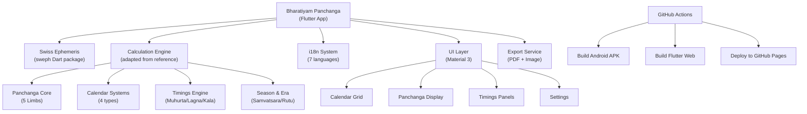

# Bharatiyam Panchanga — Implementation Plan v2

A full-featured Hindu Panchanga (almanac) **Flutter app** with **Android APK** + **Web preview**, built via **GitHub Actions**. Powered by **Swiss Ephemeris** (`sweph` Dart package) with **Lahiri Ayanamsha** and **mid-limb sunrise**.

---

## Resolved Questions

| Question | Answer |
|----------|--------|
| Pournimanta | **Full calculation** — Purnima-to-Purnima boundary detection |
| Lagna timings | **Full 12-rashi rising times** for day and night |
| Night muhurtas | **Include all 15** |
| Location | **GPS auto-detect + city selector** |
| Date range | **1900–2100** |
| Export | **PDF + image export** |
| Platform | **Android app + Web preview** via GitHub Actions |

---

## Architecture



---

## Technology Stack

| Component | Technology |
|-----------|-----------|
| **Framework** | Flutter 3.x (Dart) |
| **Ephemeris** | `sweph: ^3.2.1` (Swiss Ephemeris Dart FFI wrapper) |
| **Ayanamsha** | Lahiri (`SE_SIDM_LAHIRI`) |
| **Sunrise** | Mid-limb (-0.5667° horizon altitude) |
| **Calendar widget** | `table_calendar: ^3.1.3` |
| **PDF export** | `pdf: ^3.11.3` + `printing: ^5.14.2` |
| **Image export** | `screenshot: ^3.0.0` |
| **Location** | `geolocator` (GPS) + built-in city database |
| **Storage** | `shared_preferences` (settings + cache) |
| **Build/Deploy** | GitHub Actions → APK artifact + GitHub Pages web |

---

## Proposed Changes

### 1. Project Setup

#### [NEW] `pubspec.yaml`
```yaml
name: bharatiyam_panchanga
description: "ಭಾರತೀಯಮ್ ಪಂಚಾಂಗ — Hindu Calendar & Panchanga"
version: 1.0.0+1
environment:
  sdk: '>=3.2.0 <4.0.0'
dependencies:
  flutter: { sdk: flutter }
  flutter_localizations: { sdk: flutter }
  sweph: ^3.2.1+2.10.3
  table_calendar: ^3.1.3
  shared_preferences: any
  pdf: ^3.11.3
  printing: ^5.14.2
  screenshot: ^3.0.0
  geolocator: ^13.0.0
  geocoding: ^3.0.0
  intl: ^0.19.0
  http: ^1.2.0
  path_provider: any
  share_plus: ^10.0.0
```

#### [NEW] `.github/workflows/build.yml`
GitHub Actions workflow:
- Triggers on push to `main`
- Builds Android APK (arm64, arm, x86_64)
- Builds Flutter Web
- Deploys web to GitHub Pages
- Uploads APKs as artifacts

---

### 2. Core Calculation Engine

All calculation code goes in `lib/core/`. Adapted from the reference app at [D:\bharatheeyamapp clone\lib\core](file:///D:/bharatheeyamapp clone/lib/core).

#### [NEW] `lib/core/ephemeris.dart`
Swiss Ephemeris wrapper — adapted from reference [ephemeris.dart](file:///D:/bharatheeyamapp clone/lib/core/ephemeris.dart):
- `initSweph()` — initialize with retry logic
- `calcAll(jd, ayanamsaMode, trueNode)` — all planet positions (sidereal + speed)
- `getAltitudeManual(jd, lat, lon)` — solar/lunar altitude via RA/Dec
- `findSunriseSetForDate(y, m, d, lat, lon, tzOffset)` — mid-limb sunrise at -0.5667°
- `findMoonriseSetForDate(y, m, d, lat, lon, tzOffset)` — moonrise/set

#### [NEW] `lib/core/panchanga_calculator.dart`
**Main Panchanga engine** — adapted from reference [calculator.dart](file:///D:/bharatheeyamapp clone/lib/core/calculator.dart):

**5 Core Limbs:**
| Element | Formula |
|---------|---------|
| **Tithi** | `floor(((Moon° - Sun°) % 360) / 12)` → 0–29 |
| **Nakshatra** | `floor(Moon° / 13.3333)` → 0–26, with Pada |
| **Yoga** | `floor(((Moon° + Sun°) % 360) / 13.3333)` → 0–26 |
| **Karana** | `floor(((Moon° - Sun°) % 360) / 6)` → 0–59 |
| **Vara** | Vedic weekday at sunrise |

**End Times:** Binary search (20 iterations) for each element's boundary crossing.

**Ghati Details:** Gata (elapsed), Shesha (remaining), Parama (total) in ghati-vighati for Tithi, Nakshatra, Yoga, Karana.

**Additional:** Udayadi Ghati, Chandra Rashi, Chandra Pada, Surya Nakshatra, Surya Pada.

#### [NEW] `lib/core/masa_calculator.dart`
**4 Calendar System calculations:**

**1. Amanta (Amavasyanta)** — from reference [calculator.dart L803-870](file:///D:/bharatheeyamapp clone/lib/core/calculator.dart#L803):
- Month = Amavasya to Amavasya
- Binary search for exact New Moon dates
- Adhika Masa: no Sankranti between two Amavasyas
- Nija Masa: Sankranti occurred

**2. Pournimanta (NEW — full calculation):**
- Month = Purnima to Purnima
- Binary search for exact Full Moon dates (Moon-Sun = 180°)
- Krishna Paksha first, then Shukla Paksha
- Adhika Masa detection adapted for Purnima boundaries
- Month naming: same rashi-based system, but boundaries shifted

**3. Chandra Mana (Lunar):**
- Pure lunar view combining Amanta/Pournimanta data
- Paksha subdivision (Shukla/Krishna)
- Adhika Masa insertion tracking

**4. Soura Mana (Solar)** — from reference [calculator.dart L776-801](file:///D:/bharatheeyamapp clone/lib/core/calculator.dart#L776):
- Month = Sankranti to Sankranti (Sun enters new Rashi)
- Soura Masa Gata Dina: days since last Sankranti
- Search backward for Sankranti date

#### [NEW] `lib/core/samvatsara.dart`
From reference [calculator.dart L906-925](file:///D:/bharatheeyamapp clone/lib/core/calculator.dart#L906):
- 60 Samvatsara names (Prabhava to Akshaya)
- Shalivahana Shaka year = Gregorian - 78
- Adjusts for Ugadi boundary
- Rutu (6 seasons) based on Sun's rashi pair
- Ayana: Uttarayana / Dakshinayana

#### [NEW] `lib/core/ghati_calculator.dart`
From reference [calculator.dart L872-904](file:///D:/bharatheeyamapp clone/lib/core/calculator.dart#L872):
- Visha Ghati: 27-entry lookup table, 4 ghati duration, scaled to nakshatra span
- Amruta Ghati: 27-entry lookup table, 4 ghati duration
- Clock time conversion

#### [NEW] `lib/core/muhurta_calculator.dart`
**15 Day Muhurtas** (sunrise to sunset ÷ 15):
| # | Name | Nature | # | Name | Nature |
|---|------|--------|---|------|--------|
| 1 | Rudra | Ashubha | 9 | Satmukhi | Shubha |
| 2 | Ahi | Ashubha | 10 | Puruhuta | Ashubha |
| 3 | Mitra | Shubha | 11 | Vahini | Ashubha |
| 4 | Pitru | Ashubha | 12 | Naktanakara | Madhyama |
| 5 | Vasu | Shubha | 13 | Varuna | Shubha |
| 6 | Varaha | Shubha | 14 | Aryama | Shubha |
| 7 | Vishwedeva | Shubha | 15 | Bhaga | Ashubha |
| 8 | Vidhi | Madhyama | | | |

**15 Night Muhurtas** (sunset to next sunrise ÷ 15):
| # | Name | Nature | # | Name | Nature |
|---|------|--------|---|------|--------|
| 1 | Shiva | Shubha | 9 | Isham | Madhyama |
| 2 | Guhya | Ashubha | 10 | Isha | Shubha |
| 3 | Brahma | Shubha | 11 | Mitra | Shubha |
| 4 | Indra | Shubha | 12 | Aditya | Ashubha |
| 5 | Jiva | Shubha | 13 | Kali | Ashubha |
| 6 | Dipti | Madhyama | 14 | Siddhi | Shubha |
| 7 | Vishwa | Ashubha | 15 | Nirdosha | Shubha |
| 8 | Kutsam | Ashubha | | | |

**Special Muhurtas:**
- Abhijit: midday ± half muhurta
- Durmuhurta: weekday-specific fixed offsets
- Varjyam: nakshatra-specific, 4 ghati (96 min)
- Amrita Siddhi Yoga: vara + nakshatra combinations

#### [NEW] `lib/core/lagna_calculator.dart`
**Full 12-Rashi Lagna Transit Timings (NEW):**
- Scans from sunrise to sunset (day) and sunset to next sunrise (night)
- At each time step (~10 min), computes ascendant via `swe_houses()`
- Detects when ascendant rashi changes (crosses 30° boundary)
- Binary search refinement for exact transit moment
- Output: List of `{rashi, startTime, endTime}` for all 12 rashis

#### [NEW] `lib/core/kala_calculator.dart`
From reference [panchanga_screen.dart L201-218](file:///D:/bharatheeyamapp clone/lib/screens/panchanga_screen.dart#L201):
- **Rahu Kala:** muhurta order `[8,2,7,5,6,4,3]`
- **Yamaganda:** muhurta order `[5,4,3,6,5,1,2]`
- **Gulika Kala:** muhurta order `[7,6,5,4,3,2,1]`
- Daytime ÷ 8 muhurtas, weekday-indexed

#### [NEW] `lib/core/hora_calculator.dart`
From reference [panchanga_screen.dart L263-302](file:///D:/bharatheeyamapp clone/lib/screens/panchanga_screen.dart#L263):
- 12 day + 12 night planetary hours
- Planet order: Sun, Venus, Mercury, Moon, Saturn, Jupiter, Mars
- First hora = weekday ruler

#### [NEW] `lib/core/chougadiya_calculator.dart`
From reference [panchanga_screen.dart L220-261](file:///D:/bharatheeyamapp clone/lib/screens/panchanga_screen.dart#L220):
- 8 day + 8 night periods
- 7 named periods: Udveg, Chal, Laabh, Amrut, Kaala, Shubh, Rog

---

### 3. Data Models

#### [NEW] `lib/models/panchanga_data.dart`
All data classes:
```dart
class PanchangaResult {
  // 5 Core Limbs
  String tithi, vara, nakshatra, yoga, karana;
  int tithiIndex, nakshatraIndex, yogaIndex;
  String tithiEndTime, nakEndTime, yogaEndTime, karanaEndTime;
  bool tithiEndsNextDay, nakEndsNextDay, yogaEndsNextDay, karanaEndsNextDay;
  
  // Ghati details
  String tithiGata, tithiShesha, tithiParama;
  String nakGata, nakShesha, nakParama;
  String yogaGata, yogaShesha, yogaParama;
  String karanaGata, karanaShesha, karanaParama;
  String udayadiGhati;
  
  // Sun & Moon
  String sunrise, sunset, chandraRashi, chandraPada;
  String suryaNakshatra, suryaPada;
  
  // Calendar systems
  String amantaMasa, pournimantaMasa, souraMasa;
  String souraMasaGataDina;
  String samvatsara, rutu, ayana;
  String divamana, ratrimana;
  
  // Ghatis
  String vishaPraghati, amrutaPraghati;
  String agniVasa;
  double nakPercent;
}

class LagnaTransit { String rashi; String startTime, endTime; }
class MuhurtaTiming { String name; String startTime, endTime; String nature; }
class KalaTiming { String name; String startTime, endTime; }
class HoraTiming { String planet; String startTime, endTime; String icon; }
class ChougadiyaTiming { String name; String startTime, endTime; String nature; }
```

---

### 4. Multi-Language System (i18n)

#### [NEW] `lib/i18n/app_locale.dart`
Language manager with `t(key)` and `trAll()` functions. Supports:
- **Kannada** (`kn`) — primary/default
- **Hindi** (`hi`)
- **Tamil** (`ta`)
- **Telugu** (`te`)
- **Malayalam** (`ml`)
- **English** (`en`)
- **Sanskrit** (`sa`)

Persists to SharedPreferences. Uses `ValueNotifier` for reactive UI updates.

#### [NEW] `lib/i18n/strings/` — One file per language
Each contains:
- 30 Tithi names, 27 Nakshatra names, 27 Yoga names, 11 Karana names
- 7 Vara names, 12 Rashi names, 12 Chandra Masa names, 12 Soura Masa names
- 60 Samvatsara names, 6 Rutu names
- 15 Day Muhurta + 15 Night Muhurta names
- All UI labels

#### [NEW] `lib/constants/places.dart`
~500 Indian cities with lat/lon/timezone — ported from reference [places.dart](file:///D:/bharatheeyamapp clone/lib/constants/places.dart).

---

### 5. Screens & UI

#### [NEW] `lib/screens/home_screen.dart`
App home with:
- Today's panchanga summary card
- Quick navigation to full panchanga
- Current location display
- Language selector

#### [NEW] `lib/screens/panchanga_screen.dart`
Main panchanga view — the heart of the app:
- **Calendar widget** (table_calendar) with date selection
- **Calendar system tabs**: Amanta | Pournimanta | Chandra Mana | Soura Mana
- **5 Core Limbs card** with end times and ghati details
- **Sun section**: Sunrise, Sunset, Surya Nakshatra, Soura Masa
- **Moon section**: Chandra Rashi, Chandra Masa, Parama Ghati
- **Kala section**: Samvatsara, Ayana, Rutu, Divamana, Ratrimana, Visha/Amruta Ghati
- **Ashubha Kala card**: Rahu Kala, Yamaganda, Gulika Kala
- **Day Muhurta card** (15 muhurtas with current highlighted)
- **Night Muhurta card** (15 muhurtas)
- **Special Muhurta card**: Abhijit, Durmuhurta, Varjyam, Amrita Siddhi
- **Day Lagna card** (12 rashi rising times)
- **Night Lagna card** (12 rashi rising times)
- **Day Hora card** (12 planetary hours)
- **Night Hora card** (12 planetary hours)
- **Day Chougadiya** (8 periods)
- **Night Chougadiya** (8 periods)
- **Agni Vasa card**
- **Export buttons**: PDF, Image, Share

#### [NEW] `lib/screens/settings_screen.dart`
- Location: GPS detect + city search + manual lat/lon
- Language selector (7 languages)
- Ayanamsha selector (Lahiri default, Raman, KP)
- Node type (True/Mean Rahu)
- Theme toggle (dark/light)
- About/Credits

#### [NEW] `lib/screens/search_screen.dart`
Date finder — scan for specific tithi/nakshatra/masa combinations (adapted from reference [panchanga_search_screen.dart](file:///D:/bharatheeyamapp clone/lib/screens/panchanga_search_screen.dart)).

---

### 6. Widgets

#### [NEW] `lib/widgets/panchanga_card.dart`
Reusable section card with header icon and title.

#### [NEW] `lib/widgets/muhurta_list.dart`
15-item muhurta list with color coding and current-time highlight.

#### [NEW] `lib/widgets/lagna_list.dart`
12-rashi lagna transit list with times and current rashi highlight.

#### [NEW] `lib/widgets/kala_row.dart`
Colored time range row for Rahu/Yama/Gulika.

#### [NEW] `lib/widgets/calendar_system_tabs.dart`
Tab bar: Amanta | Pournimanta | Chandra Mana | Soura Mana with animated transitions.

#### [NEW] `lib/widgets/common.dart`
Design system: colors, typography, theme, responsive helpers.

---

### 7. Services

#### [NEW] `lib/services/location_service.dart`
- GPS auto-detect via `geolocator`
- Reverse geocode for place name
- City selector with 500+ built-in cities
- Manual lat/lon/tz entry
- Persist to SharedPreferences

#### [NEW] `lib/services/cache_service.dart`
- In-memory session cache for computed panchangas
- Pre-compute ±3 days around selected date
- Persistent disk cache via SharedPreferences

#### [NEW] `lib/services/export_service.dart`
- **PDF export**: Full panchanga page using `pdf` package with Indic fonts
- **Image export**: Screenshot capture using `screenshot` package
- **Share**: Share PDF/image via `share_plus`

---

### 8. Build & Deploy

#### [NEW] `.github/workflows/build.yml`
```yaml
name: Build APK & Flutter Web
on:
  push:
    branches: [main]
  workflow_dispatch:

jobs:
  build:
    runs-on: ubuntu-latest
    steps:
      - uses: actions/checkout@v4
      - uses: subosito/flutter-action@v2
        with:
          flutter-version: '3.24.0'
      - run: flutter pub get
      - run: flutter build apk --split-per-abi
      - run: flutter build web --base-href /bharatiyam-panchanga/
      - uses: actions/upload-artifact@v4
        with:
          name: apk
          path: build/app/outputs/flutter-apk/
      - uses: peaceiris/actions-gh-pages@v4
        with:
          github_token: ${{ secrets.GITHUB_TOKEN }}
          publish_dir: build/web
```

---

## File Structure

```
bharatiyam-panchanga/
├── .github/workflows/build.yml
├── pubspec.yaml
├── lib/
│   ├── main.dart
│   ├── core/
│   │   ├── ephemeris.dart           # Swiss Ephemeris wrapper
│   │   ├── panchanga_calculator.dart # 5 Core Limbs + binary search
│   │   ├── masa_calculator.dart      # 4 Calendar Systems
│   │   ├── samvatsara.dart          # 60-year cycle, Rutu, Ayana
│   │   ├── ghati_calculator.dart    # Visha & Amruta Ghati
│   │   ├── muhurta_calculator.dart  # 15+15 Muhurtas + special
│   │   ├── lagna_calculator.dart    # 12-rashi transit timings
│   │   ├── kala_calculator.dart     # Rahu/Yama/Gulika Kala
│   │   ├── hora_calculator.dart     # 24 Planetary Hours
│   │   └── chougadiya_calculator.dart # 16 Chougadiya periods
│   ├── models/
│   │   └── panchanga_data.dart      # All data classes
│   ├── i18n/
│   │   ├── app_locale.dart          # Language manager
│   │   └── strings/                 # 7 language files
│   │       ├── kn.dart, hi.dart, ta.dart
│   │       ├── te.dart, ml.dart, en.dart, sa.dart
│   ├── constants/
│   │   └── places.dart              # 500+ Indian cities
│   ├── screens/
│   │   ├── home_screen.dart
│   │   ├── panchanga_screen.dart     # Main panchanga view
│   │   ├── settings_screen.dart
│   │   └── search_screen.dart
│   ├── widgets/
│   │   ├── common.dart              # Design system
│   │   ├── panchanga_card.dart
│   │   ├── muhurta_list.dart
│   │   ├── lagna_list.dart
│   │   ├── kala_row.dart
│   │   └── calendar_system_tabs.dart
│   └── services/
│       ├── location_service.dart
│       ├── cache_service.dart
│       └── export_service.dart
├── assets/
│   ├── fonts/                       # Noto Sans Kannada/Hindi/Tamil etc.
│   └── images/
├── android/
├── web/
└── test/
```

---

## Implementation Phases

### Phase 1: Project + Core Engine (~30 files)
1. Initialize Flutter project with `sweph` dependency
2. `ephemeris.dart` — sunrise/sunset (mid-limb) + planet positions
3. `panchanga_calculator.dart` — 5 limbs + end times + ghati
4. `masa_calculator.dart` — Amanta + Pournimanta + Chandra Mana + Soura Mana
5. `samvatsara.dart` — 60-year cycle, Rutu, Ayana, Agni Vasa
6. Data models

### Phase 2: Timings Engine
7. `ghati_calculator.dart` — Visha/Amruta Ghati
8. `muhurta_calculator.dart` — 15+15 muhurtas + Abhijit/Durmuhurta/Varjyam
9. `lagna_calculator.dart` — 12-rashi day+night transits
10. `kala_calculator.dart` — Rahu/Yama/Gulika
11. `hora_calculator.dart` — 24 planetary hours
12. `chougadiya_calculator.dart` — 16 periods

### Phase 3: i18n + Data
13. `app_locale.dart` + 7 language string files
14. `places.dart` — 500+ cities
15. `location_service.dart` — GPS + city selector
16. `cache_service.dart` — performance caching

### Phase 4: UI Screens
17. `common.dart` — design system (dark theme, Indic fonts, cards)
18. `panchanga_screen.dart` — main view with all sections
19. `home_screen.dart` — today's summary
20. `settings_screen.dart` — all preferences
21. `search_screen.dart` — date finder
22. All widget files

### Phase 5: Export + Build
23. `export_service.dart` — PDF + image + share
24. `.github/workflows/build.yml` — CI/CD
25. Polish: animations, responsiveness, testing
26. Verify against reference app output

---

## Verification Plan

### Automated
```bash
flutter test              # Unit tests for calculation engine
flutter build apk         # Verify APK builds
flutter build web         # Verify web builds
```

### Manual
- Compare 10+ dates against reference Flutter app for accuracy
- Compare against Drik Panchang for independent verification
- Test all 4 calendar systems
- Test all 7 languages
- Test GPS + city selector
- Test PDF + image export
- Test on Android device + web browser
